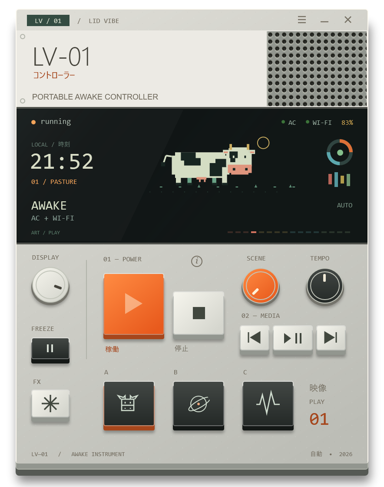
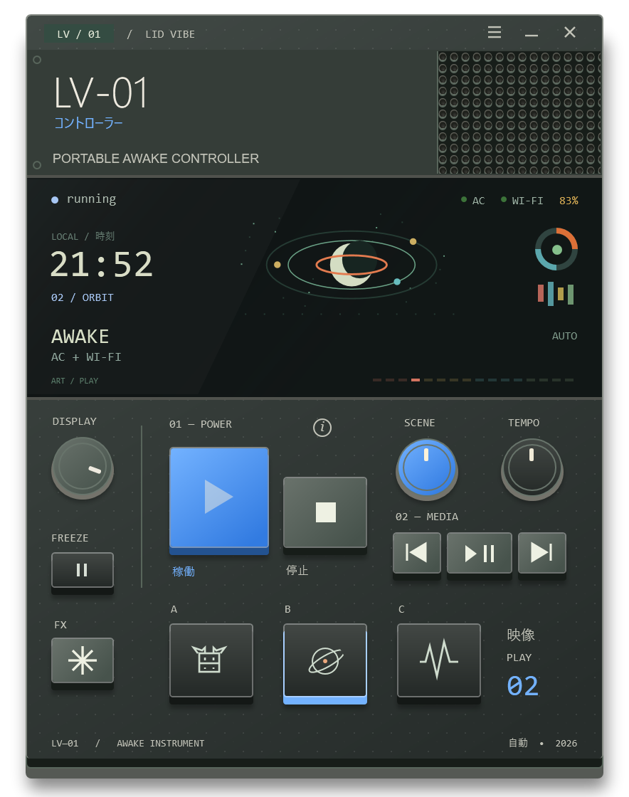

# LV-01

A small Windows awake controller with a pixel cow, tactile keys and a little too much personality.

Keep working with the lid closed while your laptop has AC power and Wi-Fi. Unplug it or lose Wi-Fi and LV-01 releases its overrides so Windows behaves normally. It never requests sleep, hibernation or shutdown, and never changes battery settings.

<p align="center">
  
  
</p>

## Download

**[Download LV-01 for Windows](https://github.com/tcf-jw/LV-01/releases)** · [MIT license](LICENSE)

1. Download `LV-01-v0.2.0-windows-x64.zip` from Releases and extract it.
2. Open `LV-01.exe`. There is no installer or sign-in.
3. Connect AC power and Wi-Fi. Wait for **AWAKE** before closing the lid.

The app stays running when minimized. Closing it turns Stay Awake off and restores the previous AC lid action. Keep your laptop ventilated; use Windows **Shut down** before putting it in a bag.

Requires Windows 11 x64 with Windows PowerShell 5.1 and .NET Framework 4.8 or later available. The app runs as your user and does not ask for administrator access. This first release is **unsigned**, so Windows may show an unknown-publisher warning. Managed computers may block the app or its power-setting changes. SHA-256 checksums accompany each release.

## Controls

| Control | What it does |
| --- | --- |
| **▶ / ■** | Start Stay Awake / turn it off and pause automatic starts. |
| **⏮ / ⏯ / ⏭ MEDIA** | Previous, play/pause and next for the player Windows selects. |
| **A / B / C** or **SCENE** | Choose the pixel cow, orbiting moons or synthetic waveforms. |
| **✳ FX / Ⅱ FREEZE** | Play a scene effect / pause only the artwork. Power monitoring continues. |
| **DISPLAY / TEMPO** | Adjust the device display brightness / animation speed. Drag, scroll or use arrow keys. Double-click resets. |
| **☰ / ⓘ** | Choose light/dark, five accents and motion settings / open the quick guide. |

Hover a control to see its meaning on the display. Keyboard focus works too. The clock and power/Wi-Fi/battery indicators reflect the laptop; the artwork is decorative. The miniature device icon comes in seven Windows sizes.

## Music and video

The three MEDIA keys send the same commands as keyboard media keys. Windows chooses the receiver, including compatible Spotify and browser/YouTube sessions. They work even when Stay Awake is off or the laptop is on battery.

Previous/next means a track or playlist item, not a fixed number of seconds. A player may restart the current track, skip, or ignore an unsupported command. With no eligible player, nothing happens. Enable media-key support in your browser/player if needed. LV-01 confirms that the key was sent; it does not claim that a particular player accepted it or display a guessed playing state.

Media-key delivery follows normal Windows input restrictions. The app does not request elevated access or change the selected player. Hover/focus explains the keys, and power-recovery warnings take priority over media feedback.

## Power behavior

| From | To | Result |
| --- | --- | --- |
| Ready, plugged in with Wi-Fi | Two successful checks | Automatically starts, normally within 5–10 seconds. |
| Awake, lid open | Charger unplugged | Releases Stay Awake, normally within one second. Windows handles battery use. |
| Awake | Wi-Fi disconnected | Releases Stay Awake, normally within five seconds. |
| Stopped by a connection loss | Power and Wi-Fi return | Restarts after two successful checks. |
| Any active state | **■** or close | Restores settings. **■** pauses auto until **▶** or a fresh launch. |

Only the AC lid-close action is temporarily changed to **Do nothing**, together with a Windows idle-sleep prevention request. The previous AC setting is saved before changes and restored afterward. Battery lid actions and timers are never changed. Wi-Fi detection checks a connected interface with an IP address; it does not prove internet or VPN access.

**Physical closed-lid operation remains unverified.** Modern Standby, firmware and organization policy can affect behavior. If the lid is already closed when a connection is lost, Windows may not receive another lid-close event, so immediate sleep is not guaranteed. See [all transitions and recovery behavior](docs/behavior.md).

## Privacy and local files

No account, telemetry, cloud calls, service or startup task. The app bundles its own code and artwork. It uses Windows components already on the computer.

The executable stores preferences and recovery information in `%LOCALAPPDATA%\LV-01`, with bundled app files in a content-addressed `app` subfolder. New builds reuse the same preferences and recovery journal. Do not delete a pending recovery journal. If both app and worker terminate unexpectedly, reopen LV-01 to restore the saved AC lid setting.

To uninstall, close the app, verify normal power behavior, and delete the executable. After restoration succeeds, its `%LOCALAPPDATA%\LV-01` folder can also be removed. There is no registry uninstall entry or automatic updater.

## Build and test

Clone this repository on Windows and run:

```powershell
powershell.exe -NoProfile -File .\build.ps1 -Test
```

This builds the multi-size icon and `dist/LV-01.exe`, packages a ZIP with the license and quick guide, and writes SHA-256 checksums. It uses the .NET Framework compiler and Windows PowerShell already installed on Windows; no npm, .NET SDK or third-party packages are needed.

The executable hosts the existing PowerShell/WPF interface in a Windows GUI process. Its power monitor runs separately so it can restore settings if the window process exits. Source lives in `src/`; packaging is in `packaging/`. Direct development launch:

```powershell
powershell.exe -NoProfile -STA -File .\src\lid-vibe-ui.ps1 -StartPaused
```

Run the safe logic suites with `tests/test-lid-vibe.ps1`, `tests/test-lid-vibe-auto.ps1`, `tests/test-lid-vibe-design.ps1` and `tests/test-media.ps1`. They cover 54 transition, automation, preference and media checks. The EXE suite adds eight packaging checks plus WPF interaction/render checks. Tests never intentionally suspend the host, change its real power settings or send media keys to running players. GitHub Actions builds and tests on Windows.

For screenshots without touching power settings:

```powershell
.\dist\LV-01.exe --preview "$PWD\preview.png" --test-data "$PWD\build\preview-data"
```

[Contributing](CONTRIBUTING.md) · [Changelog](CHANGELOG.md)

## License and design

Copyright © 2026 Joel Wu. Code and original vector artwork are available under the [MIT license](LICENSE). You may use, modify and redistribute them, including commercially, while retaining the copyright and license notice. The software is provided without warranty.

The visual reference is the [teenage engineering K.O. II](https://teenage.engineering/products/ep-133). LV-01 is an independent project with its own interface and artwork; it is not a teenage engineering product.

Media controls follow Microsoft's [virtual-key definitions](https://learn.microsoft.com/en-us/windows/win32/inputdev/virtual-key-codes) and [SendInput contract](https://learn.microsoft.com/en-us/windows/win32/api/winuser/nf-winuser-sendinput).
